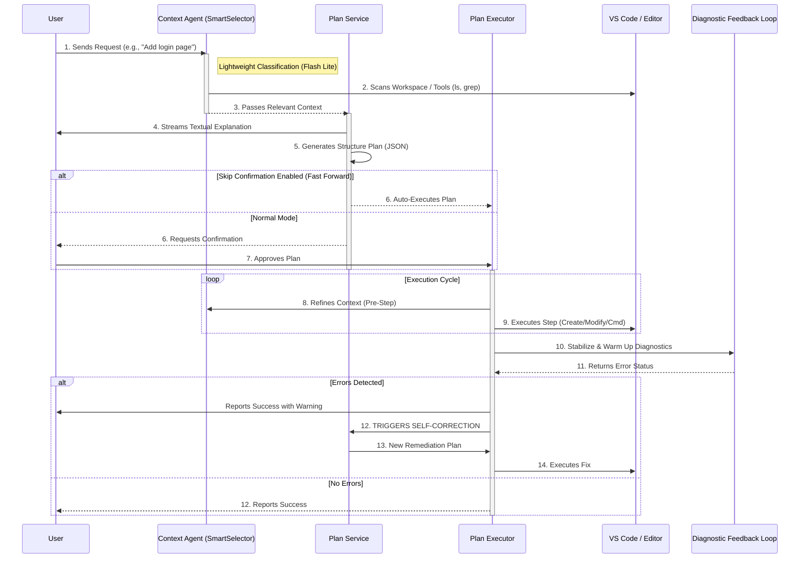

# User Workflow & Process Lifecycle

This document provides a comprehensive overview of the end-to-end workflow in the Minovative Mind extension, detailing the lifecycle of a user request from the initial message to final execution and potential self-correction.

## 🔄 Workflow Diagram

## 📝 Detailed Process Phases

### Phase 1: Initiation & Context Gathering

1.  **User Intent Analysis**: When you send a message, the **Lightweight Classification Service** (using Gemini Flash Lite) first determines if you are asking for a code modification, a general question, or reporting a bug.
2.  **Active Investigation**: If the intent requires deep context, the **Context Agent** activates. It may autonomously run "safe" terminal commands (`git ls-files`, `grep`, `find`) to locate relevant files that static analysis might miss. All commands are automatically enhanced with gitignore-aware exclusion filters to skip dependencies, build artifacts, and binary files.
    - _Example_: If you ask to "fix the auth service," it might `grep` for "AuthService" to find the definition file.
3.  **Context Construction**: The agent bundles the selected file contents, active editor state, and any diagnostic messages into a coherent prompt context.

### Phase 2: Plan Formulation

1.  **Streaming Explanation**: The AI first streams a natural language explanation of what it intends to do. This allows you to verify its understanding immediately.
2.  **Structured Plan Generation**: Simultaneously, the AI generates a JSON-structured **Execution Plan**. This plan consists of discrete steps:
    - `create_file`: Creating new assets.
    - `modify_file`: Applying changes to existing code (using search/replace blocks).
    - `run_command`: Executing shell scripts (requires explicit approval).

### Phase 3: User Review

1.  **Presentation**: The plan is visualized in the sidebar, showing exactly which files will be touched.
2.  **Confirmation**: By default, the process pauses and you must click **"Execute Plan"** to proceed. You can also edit the request or cancel at this stage.
3.  **Skip Confirmation (Fast Forward)**: When the "Fast Forward" toggle is enabled in the sidebar, the AI skips the confirmation step entirely and begins execution automatically after streaming the plan explanation.

### Phase 4: Execution

The `PlanExecutorService` takes over to orchestrate the approved steps:

- **Dynamic Context Refinement**: Before _every single step_, the Context Agent performs a mini-lookup. For example, before modifying `UserService.ts`, it might quickly read the file's current state to ensure the edit is precise.
- **Streaming Modification**: Changes are applied via Search/Replace blocks with live streaming status updates in the sidebar ("Analyzing structure", "Applying code...", "Retrying...").
  - **Visual Feedback Loop**: The plan timeline provides real-time progress indicators:
    - **Active Step**: Highlighting and live status messages.
    - **Resilience**: `(Auto-retry X/Y)` indicator displayed during transient failures.
    - **Validation**: `✓` (Success) or `⚠️` (Warning) icons appear next to file paths as they are processed.
- **Streaming Edits**: You see the code being typed into your editor in real-time.

### Phase 5: Validation & Self-Correction

This is where the agent acts autonomously to ensure quality:

1.  **Diagnostic Stabilization**: After the plan finishes, the system calls `waitForDiagnosticsToStabilize` on each modified file, then `warmUpDiagnostics`. This programmatically opens modified files and waits for VS Code's language servers (TypeScript, Python, etc.) to fully settle before reporting errors.
2.  **Error Detection**: The system checks if any _new_ errors (Severity: Error) have appeared in the workspace.
3.  **The Self-Correction Loop**:
    - **Trigger**: If the plan succeeded but errors are detected, the system **automatically** triggers the `self-correction` workflow.
    - **Remediation**: The AI is fed the original plan, the changes made, and the new error messages.
    - **Auto-Fix**: It generates and executes a new plan to fix the errors without you needing to type a new command.

### Phase 6: Completion

- **Final Report**: Once the plan (and any necessary self-correction) is done, you receive a success notification.
- **Revertibility**: A "Last Plan" snapshot is saved. If the result isn't what you wanted, you can hit the **Revert Changes** button to undo everything instantly.
